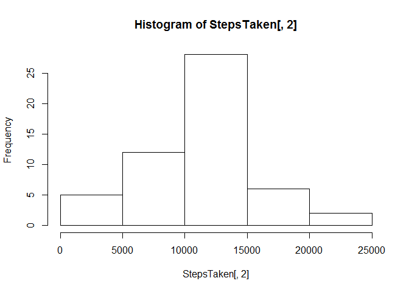
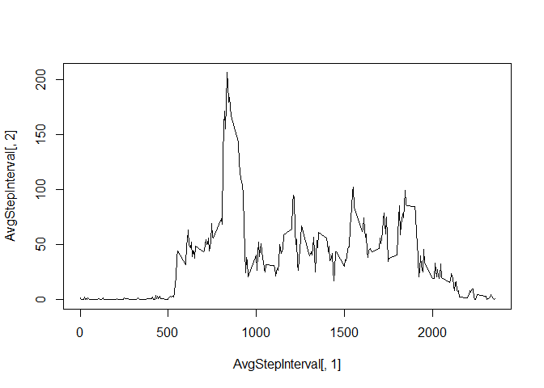
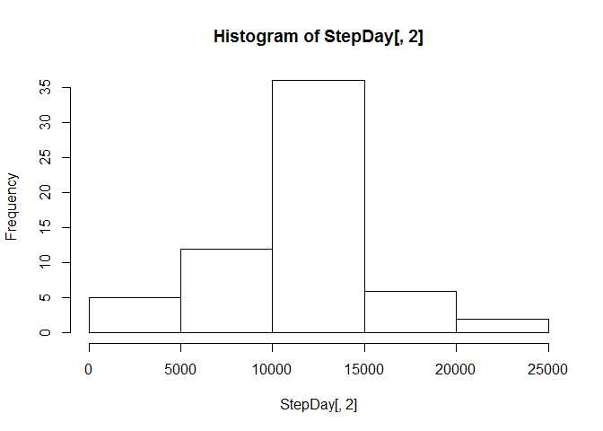
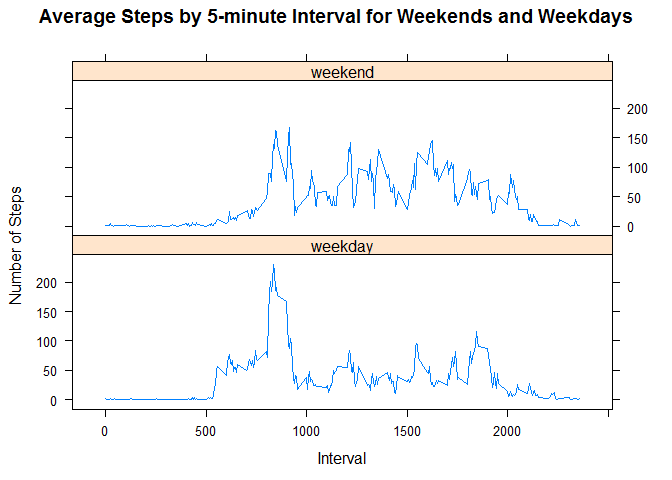

# Reproducible Research: Peer Assessment 1
********
>Author : hmarroquin
| Date : 2015-04-18

********


## Loading and preprocessing the data

```r
activitydata <- read.csv(unz("activity.zip", "activity.csv"))
attach(activitydata)
```

## What is mean total number of steps taken per day?

### Steps per day :

```r
StepsTaken = aggregate(steps~date, sum, data=activitydata)
StepsTaken
```

```
##          date steps
## 1  2012-10-02   126
## 2  2012-10-03 11352
## 3  2012-10-04 12116
## 4  2012-10-05 13294
## 5  2012-10-06 15420
## 6  2012-10-07 11015
## 7  2012-10-09 12811
## 8  2012-10-10  9900
## 9  2012-10-11 10304
## 10 2012-10-12 17382
## 11 2012-10-13 12426
## 12 2012-10-14 15098
## 13 2012-10-15 10139
## 14 2012-10-16 15084
## 15 2012-10-17 13452
## 16 2012-10-18 10056
## 17 2012-10-19 11829
## 18 2012-10-20 10395
## 19 2012-10-21  8821
## 20 2012-10-22 13460
## 21 2012-10-23  8918
## 22 2012-10-24  8355
## 23 2012-10-25  2492
## 24 2012-10-26  6778
## 25 2012-10-27 10119
## 26 2012-10-28 11458
## 27 2012-10-29  5018
## 28 2012-10-30  9819
## 29 2012-10-31 15414
## 30 2012-11-02 10600
## 31 2012-11-03 10571
## 32 2012-11-05 10439
## 33 2012-11-06  8334
## 34 2012-11-07 12883
## 35 2012-11-08  3219
## 36 2012-11-11 12608
## 37 2012-11-12 10765
## 38 2012-11-13  7336
## 39 2012-11-15    41
## 40 2012-11-16  5441
## 41 2012-11-17 14339
## 42 2012-11-18 15110
## 43 2012-11-19  8841
## 44 2012-11-20  4472
## 45 2012-11-21 12787
## 46 2012-11-22 20427
## 47 2012-11-23 21194
## 48 2012-11-24 14478
## 49 2012-11-25 11834
## 50 2012-11-26 11162
## 51 2012-11-27 13646
## 52 2012-11-28 10183
## 53 2012-11-29  7047
```

### Histogram of Steps per day :

```r
hist(StepsTaken[,2])
```

 

### Mean and Median :

```r
mean(StepsTaken[,2])
```

```
## [1] 10766.19
```

```r
median(StepsTaken[,2])
```

```
## [1] 10765
```

***************************************

## What is the average daily activity pattern?

### Time Series:


```r
AvgStepInterval=aggregate(steps~interval, mean, data=activitydata)
plot(AvgStepInterval[,1],AvgStepInterval[,2],type = "l")
```

 

### Max Step Interval :

```r
AvgStepInterval[,1][which(AvgStepInterval[,2]==max(AvgStepInterval[,2]))]
```

```
## [1] 835
```

**************************************

## Imputing missing values

### Missing values in dataset :

```r
sum(is.na(steps))
```

```
## [1] 2304
```

### Strategy to back fill missing values :
- Calculate mean of interval
- backfill missing values with mean
- create new dataset with all values


```r
activitydatafull=activitydata
MeanStepInt=aggregate(steps~interval, mean, data=activitydatafull)
for (i in MeanStepInt[,1]){
     #find out how many are missing for one time interval
     lengthmissing=length(activitydatafull[is.na(activitydatafull$steps)&activitydatafull$interval==i,][,1])
     activitydatafull[is.na(activitydatafull$steps)&activitydatafull$interval==i,][,1]=rep(MeanStepInt[,2][MeanStepInt[,1]==i],lengthmissing)
    }
```

### Histogram, Meand and Median with FUll Dataset:

```r
StepDay=aggregate(steps~date, sum, data=activitydatafull)
hist(StepDay[,2])
```

 

```r
mean(StepDay[,2])
```

```
## [1] 10766.19
```

```r
median(StepDay[,2])
```

```
## [1] 10766.19
```

#### Observations :
- General Trend looks to be the same.
- Values only slightly increased
- Strategy to backfill data proves to be efficient for further analysis

****************************************

## Are there differences in activity patterns between weekdays and weekends?

### Factor week variable added :

```r
activitydatafull$week=weekdays(as.Date(activitydatafull$date))
for (i in 1:length(activitydatafull$week)){
  if (activitydatafull$week[i] == "Saturday" || activitydatafull$week[i] == "Sunday"){
    activitydatafull$week[i] = "weekend"
  }else{ activitydatafull$week[i] = "weekday"}
}
activitydatafull$week=as.factor(activitydatafull$week)
```

### Panel Plot : 

```r
library(ggplot2)
```

```
## Warning: package 'ggplot2' was built under R version 3.1.2
```

```r
library(lattice)
StepIntervalFull=aggregate(steps~interval+week, mean, data=activitydatafull)
xyplot(steps ~ interval | week, data = StepIntervalFull, 
       type = "l", layout = c(1,2), xlab = "Interval", ylab = "Number of Steps", 
       main = "Average Steps by 5-minute Interval for Weekends and Weekdays")
```

 

#### Observations :
- Higher activity on weekends
- Weekend activity is more spreadout.
